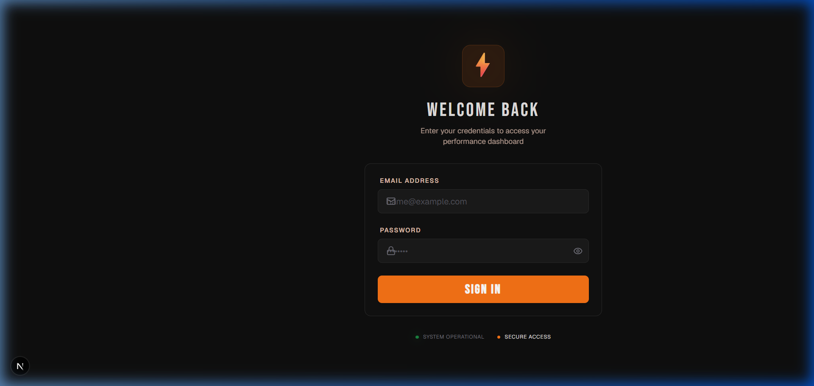
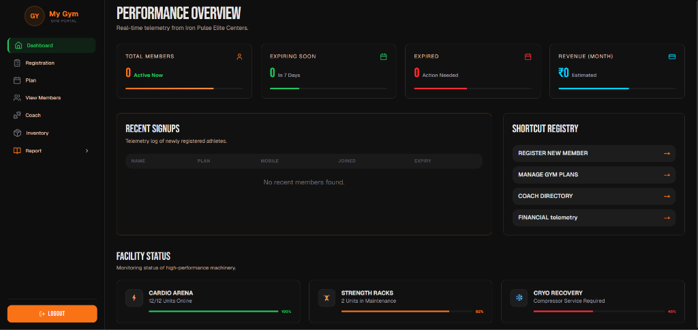

<div align="center">

# ⚡ IRON PULSE — Gym Management SaaS

**A premium multi-tenant Gym Management System built with Next.js 15, MongoDB, and NextAuth.**  
Manage members, coaches, plans, revenue, and inventory — all within a secure, isolated gym portal.

[](https://nextjs.org)
[](https://www.mongodb.com)
[](https://www.typescriptlang.org)
[](https://tailwindcss.com)
[](LICENSE)

**[🚀 Live Demo](https://gymsphere-hub.vercel.app/)** · **[📂 GitHub](https://github.com/Saurabh-1706/Gym_management_system)**

</div>

---

## 📸 Screenshots

### 🔐 Login Page


### 📊 Performance Dashboard


---

## 🔑 Demo Login

> Try the app instantly with the pre-seeded admin account:

| Field    | Value               |
|----------|---------------------|
| **URL**  | `/auth`             |
| **Email**| `admin@gmail.com`   |
| **Password** | `Admin@123`     |
| **Role** | `super_admin`       |

After login you will be redirected to → `/{tenant-slug}/dashboard`

---

## ✨ Features

### 🏢 Multi-Tenant SaaS Architecture
- Each gym gets its own **isolated workspace** at `/{slug}/dashboard`
- Full **data isolation** — tenants can never access each other's data
- Dynamic **gym branding** (name, logo, primary color) injected per tenant
- Path-based routing middleware validates tenant existence on every request

### 👥 Member Management
- Register new members with profile photos
- Track membership plans, join dates, and expiry
- View **Expiring Soon** and **Expired Members** dashboards
- Member detail page with full payment history and renewal

### 💪 Coach Directory
- Add and manage coaches with salary tracking
- Individual coach profile pages with payout history

### 💰 Financial Telemetry
- Monthly revenue tracking
- Sale reports, new joinee reports
- Electricity bill and miscellaneous expense tracking

### 📦 Inventory Management
- Track gym equipment and supplies
- Add / update / delete inventory items

### 🔐 Authentication & Roles
- **NextAuth.js** with JWT sessions
- Roles: `super_admin`, `gym_admin`, `staff`
- Super Admins access the **SaaS Control Center** at `/super-admin/dashboard`
- Onboarding page restricted to Super Admins only

### 🎨 Gym Branding
- `useGym()` context hook provides live gym `name`, `logo`, `primaryColor`
- Sidebar logo and name update automatically per tenant
- Full-page loader branded with active gym colors

---

## 🏗️ Tech Stack

| Layer | Technology |
|---|---|
| Framework | Next.js 15 (App Router) |
| Language | TypeScript |
| Styling | Tailwind CSS v4 |
| Database | MongoDB + Mongoose |
| Auth | NextAuth.js (JWT) |
| Icons | Lucide React |
| Fonts | Bebas Neue + Geist |

---

## 🚀 Getting Started

### Prerequisites
- Node.js 18+
- MongoDB Atlas account (or local MongoDB)
- A `.env.local` file (see below)

### 1. Clone & Install

```bash
git clone https://github.com/Saurabh-1706/Gym_management_system.git
cd Gym_management_system
npm install
```

### 2. Configure Environment Variables

Create a `.env.local` file in the project root:

```env
MONGODB_URI=mongodb+srv://<user>:<password>@cluster.mongodb.net/gymapp
NEXTAUTH_SECRET=your-random-secret-32-chars-min
NEXTAUTH_URL=http://localhost:3000
```

### 3. Seed the Database

Run the seeding script to create the default tenant and admin users:

```bash
npm run seed
```

This creates:
- **Tenant**: `Mojad Fitness` (slug: `mojad-fitness`)
- **Super Admin**: `admin@gmail.com` / `Admin@123`
- **Gym Admin**: `saurabhmojad1706@gmail.com` / `S@urabh@1706`

### 4. Run Development Server

```bash
npm run dev
```

Open [http://localhost:3000](http://localhost:3000) — you will be redirected to the login page.

---

## 📁 Project Structure

```
src/
├── app/
│   ├── [tenantSlug]/          # All tenant-scoped pages
│   │   ├── dashboard/         # Main dashboard
│   │   ├── members/           # Member listing + detail
│   │   ├── coach/             # Coach directory + detail
│   │   ├── plan/              # Membership plans
│   │   ├── registration/      # New member registration
│   │   ├── inventory/         # Equipment management
│   │   ├── revenue/           # Revenue analytics
│   │   ├── expiringsoon/      # Expiring memberships
│   │   ├── expiredmembers/    # Expired memberships
│   │   ├── report/            # Sale, joinee, utility reports
│   │   ├── layout.tsx         # Tenant-aware layout + CSS branding
│   │   └── loading.tsx        # App Router loading UI (GymLoader)
│   ├── auth/                  # Login page
│   ├── onboarding/            # New gym registration (super_admin only)
│   ├── super-admin/           # SaaS Control Center
│   └── api/                   # Backend API routes
│       ├── members/
│       ├── coach/
│       ├── plans/
│       ├── inventory/
│       ├── revenue/
│       ├── registration/
│       ├── onboarding/
│       ├── super-admin/
│       └── tenant/
├── components/
│   ├── navbar/GymLogo.tsx     # Dynamic gym logo component
│   ├── ui/GymLoader.tsx       # Full-page branded loader
│   ├── Navbar.tsx             # Sidebar navigation
│   ├── LayoutWrapper.tsx      # Responsive layout shell
│   └── Loader.tsx             # Animated page loader
├── context/
│   ├── GymContext.tsx         # useGym() hook + provider
│   └── LoaderContext.tsx      # useLoader() hook + provider
├── lib/
│   ├── auth.ts                # NextAuth authOptions
│   ├── mongodb.ts             # Mongoose connection
│   └── tenantGuard.ts         # API middleware for tenant isolation
├── models/
│   ├── Tenant.ts
│   ├── User.ts
│   ├── Member.ts
│   ├── Coach.ts
│   ├── Plan.ts
│   ├── Inventory.ts
│   ├── ElectricityBill.ts
│   └── Miscellaneous.ts
├── middleware.ts               # Next.js edge middleware (tenant validation)
└── types/
    └── next-auth.d.ts          # Session type extensions
```

---

## 🌐 Multi-Tenant Architecture

```
Browser: /mojad-fitness/dashboard
         ↓
Next.js Middleware → validates slug via /api/tenant
         ↓
[tenantSlug]/layout.tsx → fetches branding, injects CSS vars
         ↓
API calls → withTenantGuard() → extracts tenantId from JWT session
         ↓
MongoDB queries → filtered by { tenantId } on every operation
```

Every gym's data is **completely isolated** at the database query level. Even if a user guesses a MongoDB ObjectId, the `tenantId` filter prevents cross-tenant data access.

---

## 🔒 Roles & Access

| Role | Access |
|---|---|
| `super_admin` | `/super-admin/dashboard`, `/onboarding`, all API routes |
| `gym_admin` | `/{slug}/*` — full access to their own gym |
| `staff` | `/{slug}/*` — limited access (future) |

---

## 📜 Scripts

```bash
npm run dev      # Start development server
npm run build    # Build for production
npm run seed     # Seed default tenant + admin users
```

---

## 🙏 Acknowledgements

- [Next.js](https://nextjs.org) — App Router & server components
- [MongoDB Atlas](https://www.mongodb.com) — Cloud database
- [NextAuth.js](https://next-auth.js.org) — Authentication
- [Lucide React](https://lucide.dev) — Icon library
- [Tailwind CSS](https://tailwindcss.com) — Utility-first styling

---

<div align="center">

Made with ⚡ by **Saurabh Mojad**  
[GitHub](https://github.com/Saurabh-1706) · [LinkedIn](https://linkedin.com/in/saurabh-mojad)

</div>
